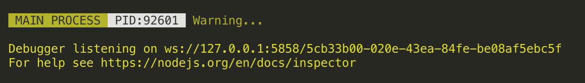

# electron-dev-webpack-plugin

A webpack plugin for electron development, When the file changes automatically restart electron main process. example: [shortcut-capture](https://github.com/nashaofu/shortcut-capture/blob/master/build/main/webpack.dev.conf.js#L14)



## Install

[](https://nodei.co/npm/electron-dev-webpack-plugin/)

## Usage

```ts
import path from 'path'
import webpack, { Configuration } from 'webpack'
import ElectronDevWebpackPlugin from './src'

const config: Configuration = {
  mode: 'development',
  entry: {
    app: './app.js'
  },
  output: {
    path: path.resolve(__dirname, '../dist'),
    filename: '[name].js'
  },
  watch: true,
  devtool: false,
  plugins: [
    new ElectronDevWebpackPlugin()
    // or
    new ElectronDevWebpackPlugin({
      port: 5858 // electron inspect port
    })
  ]
}

webpack(config, (err, stats) => {
  console.log(err)
})
```

## Options

```ts
interface Options {
  port?: number
  title?: string
  info?: (data: string) => void
  warn?: (data: string) => void
}
```

- port: electron inspect port, default `5858`

```js
new ElectronDevWebpackPlugin({
  port: 5858 // electron inspect port
})
```

- title: Plugin log title, default `MAIN PROCESS`

```js
new ElectronDevWebpackPlugin({
  title: 'MAIN PROCESS'
})
```

- info: Functions for custom output logs

```js
new ElectronDevWebpackPlugin({
  info: data => console.log('INFO', data)
})
```

- warn: Custom function to output warnings

```js
new ElectronDevWebpackPlugin({
  warn: data => console.warn('WARN', data)
})
```
